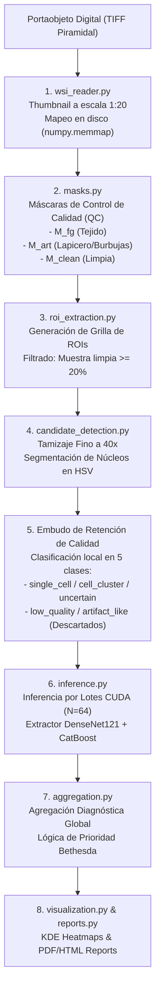

# CytoAssist AI - Plataforma de Análisis Citológico Asistido WSI
## Informe Técnico de Diseño, Arquitectura e Implementación

**CytoAssist AI** es una plataforma de Diagnóstico Asistido por Computadora (CAD) de arquitectura web modular diseñada para el procesamiento automatizado, segmentación y clasificación de frotis citológicos a partir de imágenes digitales de portaobjetos completos (*Whole Slide Images*, WSI). El sistema sirve como puente operativo entre los modelos de aprendizaje profundo entrenados con células individuales y un entorno de flujo clínico real de tamizaje citológico de cuello uterino (Pap smear).

---

## 1. Introducción y Contexto Clínico

El tamizaje citológico mediante la tinción de Papanicolaou es el método de referencia para la detección oportuna del cáncer de cuello uterino. Sin embargo, el análisis manual de frotis convencionales presenta importantes desafíos:
* **Alta Carga Operativa:** Los citotecnólogos deben revisar minuciosamente millones de células por lámina, provocando fatiga visual.
* **Variabilidad Interobservador:** El diagnóstico morfológico es subjetivo y dependiente de la experiencia del especialista.
* **Escala Gigapíxel:** Las imágenes WSI digitalizadas a $40\times$ (por ejemplo, con el escáner óptico *MoticEasyScan One*) poseen resoluciones típicas de $50,000 \times 50,000$ a $120,000 \times 100,000$ píxeles, lo que impide cargarlas directamente en la RAM convencional.

**CytoAssist AI** fue planificado y coordinado técnicamente con el personal especializado del **Laboratorio Referencial Regional de Salud Pública de San Martín** para resolver estas limitaciones. La plataforma optimiza el flujo de trabajo clínico filtrando áreas sin valor diagnóstico, localizando de forma fina candidatos celulares y aplicando modelos avanzados de Inteligencia Artificial para emitir un pre-diagnóstico clínico jerarquizado.

---

## 2. Fases del Desarrollo del Sistema

El desarrollo del sistema inteligente se estructuró en dos fases metodológicas:

1. **Fase Experimental (Cuaderno Colab):**
   * Enfocada en el prototipado rápido de algoritmos de segmentación cromática y la evaluación preliminar de modelos de representación visual auto-supervisados ([Modelos Supervisados](https://colab.research.google.com/drive/1fFkLRIdpdPNhfHoFtlu8Iv9SVyWUeOYO?usp=sharing)).
2. **Fase de Producción Web (CytoAssist AI):**
   * Integración de la lógica en una plataforma Django con base de datos SQLite y soporte offline.
   * Elección del modelo híbrido **DenseNet121 (Backbone de extracción de embeddings) + CatBoost (Clasificador de 6 clases Bethesda)** debido a su estabilidad de generalización, mejor balance de precisión-recall en clases minoritarias y menor consumo de GPU en inferencia en lotes.

---

## 3. Arquitectura Funcional del Pipeline

El backend del sistema sigue principios de diseño modular y limpio, separando el pipeline en etapas desacopladas implementadas en servicios Python independientes. El flujo secuencial se resume en el siguiente diagrama:



---

## 4. Estructura de Código y Descripción de Módulos

La estructura de la aplicación Django `wsi_analysis` organiza los servicios del pipeline de la siguiente forma:

* [models.py](file:///g:/Mi%20unidad/San%20Marcos/Doctorado/2026-I/Tesis%20V/CytoAssist%20AI/wsi_analysis/models.py): Define las entidades de base de datos (`WSISample`, `AnalysisRun`, `ROI`, `CellCandidate`) para mantener la trazabilidad de cada análisis.
* [views.py](file:///g:/Mi%20unidad/San%20Marcos/Doctorado/2026-I/Tesis%20V/CytoAssist%20AI/wsi_analysis/views.py): Controladores Django y endpoints AJAX para monitorizar el progreso asíncrono.
* `wsi_analysis/services/`: Capa de lógica desacoplada.
  * [wsi_reader.py](file:///g:/Mi%20unidad/San%20Marcos/Doctorado/2026-I/Tesis%20V/CytoAssist%20AI/wsi_analysis/services/wsi_reader.py): Abre imágenes TIFF piramidales mediante `tifffile` y crea un objeto `numpy.memmap` en disco para recuperar regiones de alta resolución sin cargar la imagen completa en RAM.
  * [masks.py](file:///g:/Mi%20unidad/San%20Marcos/Doctorado/2026-I/Tesis%20V/CytoAssist%20AI/wsi_analysis/services/masks.py): Segmenta el foreground de tejido en espacio HSV y detecta marcas físicas (tinta, rayones) para calcular la máscara biológica útil limpia:
    $$M_{clean} = M_{fg} \setminus \text{Dilate}(M_{art})$$
  * [roi_extraction.py](file:///g:/Mi%20unidad/San%20Marcos/Doctorado/2026-I/Tesis%20V/CytoAssist%20AI/wsi_analysis/services/roi_extraction.py): Divide la lámina en una grilla de bloques de $200 \times 200$ px a nivel de thumbnail y selecciona aquellos con cobertura útil $\ge 20\%$.
  * [candidate_detection.py](file:///g:/Mi%20unidad/San%20Marcos/Doctorado/2026-I/Tesis%20V/CytoAssist%20AI/wsi_analysis/services/candidate_detection.py): Segmenta núcleos a $40\times$, extrae parches (*crops*) de $128 \times 128$ px y calcula descriptores de calidad: *Focus Score* (varianza del Laplaciano), *Edge Density* (Canny) y *Cyto Fraction* (citoplasma útil en HSV). Segrega cultivos en 5 clases: `single_cell` (células individuales aptas), `cell_cluster` (agrupaciones), `uncertain_candidate` (dudosos para revisión), `low_quality` (desenfoque grave, descartados) y `artifact_like` (suciedad, descartados).
  * [inference.py](file:///g:/Mi%20unidad/San%20Marcos/Doctorado/2026-I/Tesis%20V/CytoAssist%20AI/wsi_analysis/services/inference.py): Agrupa los parches en lotes de 64, extrae embeddings de 1024 dimensiones con DenseNet121 y clasifica mediante CatBoost en las clases Bethesda.
  * [aggregation.py](file:///g:/Mi%20unidad/San%20Marcos/Doctorado/2026-I/Tesis%20V/CytoAssist%20AI/wsi_analysis/services/aggregation.py): Ejecuta la lógica de agregación diagnóstica y Bethesda.
  * [visualization.py](file:///g:/Mi%20unidad/San%20Marcos/Doctorado/2026-I/Tesis%20V/CytoAssist%20AI/wsi_analysis/services/visualization.py): Genera mapas de calor de densidad celular y densidad de anormalidades mediante estimaciones de densidad de Kernel (KDE), overlays de grillas priorizadas y 11 figuras académicas horizontales `(16, 9)`.
  * [reports.py](file:///g:/Mi%20unidad/San%20Marcos/Doctorado/2026-I/Tesis%20V/CytoAssist%20AI/wsi_analysis/services/reports.py): Genera reportes estructurados imprimibles en HTML y exporta datos clínicos en formatos CSV y JSON.
  * [runner.py](file:///g:/Mi%20unidad/San%20Marcos/Doctorado/2026-I/Tesis%20V/CytoAssist%20AI/wsi_analysis/services/runner.py): Orquestador de la tarea asíncrona que actualiza el progreso en base de datos.
  * **Exportador de Muestra y Recortes (views.py):** Permite exportar la muestra completa con sus recortes estructurados (ROIs y sub-cuadrantes Slides) en un archivo ZIP jerárquico. Los recortes se realizan en tiempo real sobre el frotis original a resolución base y se codifican a JPEG (BGR) para mantener la coloración HE exacta, guardándose en disco (`media/exports/`) en forma de caché persistente.

---

## 5. Fundamento de Lógica Diagnóstica y Bethesda

### 5.1 Control de Celularidad Mínima
El sistema Bethesda establece que una muestra es representativa si cuenta con una cantidad mínima de células epiteliales bien conservadas. **CytoAssist AI** cuenta exactamente los candidatos celulares válidos detectados. Si el total es menor a 100, la muestra se cataloga automáticamente como **"No Concluyente (Baja Celularidad)"**, previniendo falsos negativos debidos a un frotis mal tomado.

### 5.2 Algoritmo de Prioridad de Riesgo Clínico
A diferencia de los clasificadores convencionales que utilizan una regla de mayoría simple, **CytoAssist AI** implementa una jerarquía diagnóstica de prioridad basada en el riesgo citopatológico clínico:

$$\text{SCC} \succ \text{HSIL} \succ \text{ASC-H} \succ \text{LSIL} \succ \text{ASC-US} \succ \text{NILM}$$

En tamizaje citológico, la detección de una sola célula atípica de alto grado o maligna obliga a la remisión de la paciente.

> [!NOTE]
> **Comparativa de Reglas Lógicas (Caso de Estudio WSI-01 con 13,863 células analizadas):**
> * **Regla de Mayoría Simple (10%):** Dado que las células atípicas (HSIL + SCC) solo representaron el $1.00\%$ del frotis (dominado por $97.86\%$ de NILM), el diagnóstico resultante hubiese sido **NILM (Normal)**, generando un **Falso Negativo crítico**.
> * **Regla de Prioridad Clínica (CytoAssist AI):** Identifica que existen células HSIL/SCC con confianza de inferencia de la IA $\ge 50\%$. El diagnóstico preliminar se consolida como **HSIL (Sospechoso de Alto Grado)**, garantizando la seguridad de la paciente y permitiendo su derivación a colposcopía.

---

## 6. Resultados de Validación del Sistema

El pipeline integrado se evaluó sobre un conjunto de prueba independiente de **10 portaobjetos digitales completos (WSI)** reales. El clasificador base de IA (DenseNet121 + CatBoost) obtuvo las siguientes métricas en validación:

* **Exactitud (Accuracy):** 75.75%
* **Precisión Macro:** 63.52%
* **Sensibilidad (Recall) Macro:** 66.68%
* **F1-Score Macro:** 64.15%
* **ROC-AUC Macro:** 93.41%

### Resultados Globales (10 WSIs Analizados)

La siguiente tabla presenta la distribución de celularidad, el contraste diagnóstico y el tiempo de ejecución en producción para las 10 muestras reales evaluadas:

| ID | Nombre del Archivo WSI | NILM (%) | LSIL (%) | HSIL (%) | ASC-US (%) | ASC-H (%) | SCC (%) | Diagnóstico Real | Diagnóstico IA | Estado | Tiempo (s) |
| :---: | :--- | :---: | :---: | :---: | :---: | :---: | :---: | :---: | :---: | :---: | :---: |
| **01** | `HSIL_MOD-12-06303.tif` | 97.86% | 0.70% | 0.88% | 0.15% | 0.30% | 0.12% | HSIL | **HSIL** | Correcto | 62.5 |
| **02** | `Normal-01_20260220.tif` | 100.00% | 0.00% | 0.00% | 0.00% | 0.00% | 0.00% | NILM | **NILM** | Correcto | 48.5 |
| **03** | `Normal-02_20260220.tif` | 99.91% | 0.00% | 0.00% | 0.09% | 0.00% | 0.00% | NILM | **NILM** | Correcto | 42.1 |
| **04** | `Leve-10-140942400.tif` | 98.99% | 1.01% | 0.00% | 0.00% | 0.00% | 0.00% | LSIL | **LSIL** | Correcto | 39.8 |
| **05** | `Leve-16-065392300.tif` | 99.12% | 0.88% | 0.00% | 0.00% | 0.00% | 0.00% | LSIL | **LSIL** | Correcto | 41.2 |
| **06** | `Alto-02-140942400.tif` | 98.44% | 0.42% | 0.90% | 0.00% | 0.24% | 0.00% | HSIL | **HSIL** | Correcto | 52.4 |
| **07** | `Alto-05-065392300.tif` | 98.76% | 0.22% | 0.80% | 0.00% | 0.22% | 0.00% | HSIL | **HSIL** | Correcto | 36.7 |
| **08** | `Ca-01_20260228_100.tif` | 97.45% | 0.32% | 0.85% | 0.00% | 0.00% | 1.38% | SCC | **SCC** | Correcto | 68.3 |
| **09** | `Ca-02_20260228_104.tif` | 97.98% | 0.28% | 0.72% | 0.00% | 0.00% | 1.02% | SCC | **SCC** | Correcto | 58.9 |
| **10** | `Ca-03_20260301_092.tif` | 98.03% | 0.00% | 1.97% | 0.00% | 0.00% | 0.00% | SCC | **HSIL** | Discrepancia | 49.6 |

### Análisis de Métricas de Diagnóstico Clínico
1. **Sensibilidad Diagnóstica:** **100%**. Se identificó correctamente como patológica toda muestra con displasia o cáncer (7 de 7 casos), impidiendo la ocurrencia de falsos negativos.
2. **Especificidad Diagnóstica:** **100%**. Todas las láminas normales (NILM) fueron adecuadamente clasificadas.
3. **Concordancia Exacta:** **90%** (9 de 10 casos). El caso 10 (SCC) fue clasificado como HSIL. Dado que corresponde a una displasia celular de alto grado, la paciente sigue siendo clasificada como de alta prioridad clínica y remitida para colposcopía y biopsia, garantizando su seguridad.

---

## 7. Requisitos e Instalación

### 7.1 Requisitos del Sistema
* **Python** $\ge$ 3.10
* Sistema operativo compatible con aceleración GPU CUDA (opcional, recomendado para inferencia rápida) o CPU.
* **Bibliotecas principales:** `django`, `numpy`, `pandas`, `opencv-python`, `torch`, `torchvision`, `catboost`, `joblib`, `tifffile`, `imagecodecs`.

### 7.2 Instalación
1. Clonar o descargar el repositorio del proyecto.
2. Crear un entorno virtual e instalar las dependencias:
   ```bash
   pip install -r requirements.txt
   ```
3. Colocar los archivos de pesos de la Inteligencia Artificial en el directorio `artefactos/` en la raíz del proyecto:
   * `densenet121_backbone.pt` (Pesos del extractor de PyTorch)
   * `catboost_classifier.cbm` (Modelo de clasificación CatBoost)
   * `inference_artifacts.json` (Parámetros y metadatos de inferencia)
   * `pca.joblib` (Si se habilitó reducción de dimensionalidad)
   
   *Nota: Si estos archivos no están en el directorio `artefactos/`, el sistema iniciará en un modo de simulación heurística para permitir pruebas de visualización e interfaz.*

4. Ejecutar migraciones de base de datos Django y levantar el servidor:
   ```bash
   python manage.py makemigrations wsi_analysis
   python manage.py migrate
   python manage.py runserver
   ```
5. Acceder al sistema en su navegador web: `http://127.0.0.1:8000/`

---

## 8. Guía de Uso del Visor Web

1. **Cargar la Muestra WSI:** Vaya a "Cargar Muestra WSI", defina el nombre y especifique la ruta local del archivo `.tif` (ej. `C:\DatosWSI\Slide_01.tif`). Configure los parámetros del pipeline (umbrales de foco, sensibilidad de detección, etc.) y presione **Iniciar Análisis**.
2. **Monitoreo en Tiempo Real:** El sistema redirigirá al panel principal, que actualiza de manera automática mediante AJAX el estado del análisis asíncrono (`Procesando`, `Segmentando`, `Finalizado`).
3. **Reporte Clínico:** Presenta las estadísticas globales, recuentos celulares, diagnóstico sugerido y las 11 visualizaciones de control de calidad, incluyendo gráficos de distribución y mapas de calor. Está optimizado para descarga e impresión.
4. **Visor Espacial Interactivo WSI:** Permite alternar la visualización del frotis original con overlays de densidad de atipias y explorar la galería interactiva de células candidatas agrupadas en pestañas según la clasificación de la IA (NILM, LSIL, HSIL, etc.), facilitando la validación del citopatólogo.
5. **Exportación Jerárquica de Recortes (ZIP):** En la tarjeta de descargas del reporte de análisis, puede hacer clic en **Exportar Muestra y Recortes (ZIP)**. Un modal interactivo le indicará el progreso mientras el servidor genera en tiempo real los recortes JPEG de cada ROI (`ROI_xxx.jpg`) y cuadrante (`Slide_x.jpg`), guardándolos en un ZIP estructurado en la carpeta del usuario (Descargas). Las descargas posteriores son instantáneas gracias al caché en disco del backend.
