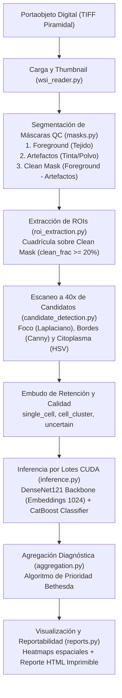

# CAPÍTULO 6. SISTEMA INTELIGENTE DE DIAGNÓSTICO AUTOMÁTICO DE LESIONES CELULARES SOBRE PORTAOBJETOS DIGITALES COMPLETOS

---

## 6.1 Introducción al sistema

El presente capítulo expone el diseño, la implementación y la evaluación de un sistema inteligente orientado al diagnóstico automatizado de lesiones celulares cervicales a partir de portaobjetos digitales completos (*Whole Slide Images*, WSI). El sistema constituye la etapa final de integración de los modelos híbridos de visión artificial y aprendizaje profundo desarrollados y validados en el capítulo anterior, y representa su aplicación directa en un entorno clínico real de tamizaje citológico de cuello uterino.

A diferencia de los enfoques tradicionales de investigación que limitan su alcance a clasificar conjuntos de células pre-seleccionadas o recortes manuales aislados, el sistema propuesto opera de manera autónoma sobre imágenes digitales de portaobjetos completos, reproduciendo el flujo real de observación citopatológica. Este enfoque permite analizar no solo las células de forma individual, sino también su distribución espacial en la lámina, su densidad relativa y sus patrones de agrupación morfológica, aspectos que resultan fundamentales en el diagnóstico citológico médico.

La concepción del sistema siguió un desarrollo evolutivo estructurado en dos fases clave:
1. **Fase Experimental (Cuaderno Colab):** Una etapa inicial de exploración y prototipado rápido donde se implementó un pipeline básico de segmentación por color y se evaluaron modelos como la arquitectura auto-supervisada **DenseNet121 + CatBoost**, disponible de forma reproducible a través del notebook de Google Colab ([Tesis-Valles-Parte-II.ipynb](https://colab.research.google.com/drive/1fFkLRIdpdPNhfHoFtlu8Iv9SVyWUeOYO?usp=sharing)).
2. **Fase de Producción Web (CytoAssist AI):** La integración final del pipeline en una plataforma web médica modular bajo el framework Django. En esta fase, para optimizar el rendimiento y la precisión, se seleccionó el modelo **DenseNet121 + CatBoost** como el núcleo clasificador en producción debido a su superior estabilidad en la validación cruzada y su balance de precisión-recall en clases desbalanceadas. Asimismo, se incorporó una lógica de decisión basada en la prioridad de riesgo clínico (Bethesda) para superar las limitaciones diagnósticas de las reglas de mayoría simple.

---

## 6.2 Comprensión del problema

El diagnóstico citológico mediante el análisis de muestras de Papanicolaou constituye un componente esencial en la detección temprana del cáncer de cuello uterino. No obstante, en laboratorios de salud pública de regiones con alta demanda y recursos limitados, este proceso presenta desafíos asociados a la variabilidad interobservador, la subjetividad inherente a la interpretación morfológica visual de los especialistas y la elevada carga operativa, factores que pueden impactar directamente en la consistencia y oportunidad diagnóstica.

En este contexto, surge la necesidad de desarrollar sistemas inteligentes de apoyo al diagnóstico capaces de analizar imágenes citológicas de forma objetiva, reproducible y scalable a partir de portaobjetos digitales completos. Sin embargo, procesar una WSI digitalizada a gran aumento ($40\times$) impone desafíos técnicos extremos debido a su tamaño gigapíxel (resoluciones típicas de $50,000 \times 50,000$ a $120,000 \times 100,000$ píxeles), lo que impide cargarlas en la RAM de forma convencional. Adicionalmente, el sistema debe ser inmune a ruidos físicos de adquisición comunes en frotes reales, tales como marcas de lapicero, burbujas de aire bajo el cubreobjetos, moco denso o variaciones locales de enfoque.

Como parte del aseguramiento operativo del proyecto, se realizó una coordinación técnica presencial con el personal especializado del **Laboratorio Referencial Regional de Salud Pública de San Martín** para alinear el flujo de digitalización y el contexto real de aplicación del sistema. Esto permitió establecer los requerimientos clínicos y técnicos de la plataforma sobre portaobjetos físicos digitalizados con el escáner óptico *MoticEasyScan One* (Figura 31).

Figura 31. Reunión técnica en el Laboratorio Referencial de Salud Pública para la planificación del sistema inteligente de diagnóstico citológico.

---

## 6.3 Objetivo clínico y fundamento diagnóstico

El objetivo clínico del sistema es automatizar de forma preliminar y asistida la detección de atipias celulares y lesiones del epitelio cervical en portaobjetos digitales completos (WSI), proporcionando una herramienta de tamizaje objetiva y rápida para laboratorios de salud pública.

El fundamento del diseño lógico del software **CytoAssist AI** radica en replicar fielmente el protocolo y razonamiento diagnóstico de un citotecnólogo humano, estructurado en tres pilares esenciales:

1. **Replicación del Paneo Espacial:**
   El patólogo visualiza primero la lámina a bajo aumento para mapear la celularidad útil y detectar acumulaciones densas o sospechosas, y luego aplica gran aumento ($40\times$) únicamente en dichas zonas para inspeccionar la morfología nuclear fina. El sistema emula esto mediante la generación de máscaras de control de calidad sobre un thumbnail de baja resolución, restringiendo el escaneo a resolución base de $40\times$ a las regiones de interés (ROIs) válidas, optimizando radicalmente el tiempo de cómputo.
   
2. **Evaluación Obligatoria de la Celularidad:**
   Según el sistema Bethesda, una muestra es clínicamente evaluable si posee una celularidad mínima representativa. **CytoAssist AI** contabiliza de forma exacta los candidatos celulares válidos y, si la cantidad clasificada es inferior a 100 células, emite una advertencia de muestra no satisfactoria (baja celularidad), alertando sobre el riesgo de un falso negativo por muestra insuficiente.

3. **Lógica de Prioridad de Riesgo Clínico:**
   En medicina citológica, el diagnóstico de la lámina no se rige por una regla de mayoría absoluta o votación proporcional. La presencia de incluso una sola célula tumoral (SCC) o displásica de alto grado (HSIL) tiene precedencia diagnóstica sobre millones de células normales. El sistema integra un algoritmo de agregación celular que prioriza el riesgo clínico de las clases Bethesda (SCC > HSIL > ASC-H > LSIL > ASC-US > NILM), asegurando la máxima sensibilidad diagnóstica preliminar.

---

## 6.4 Arquitectura funcional del sistema

La plataforma **CytoAssist AI** ha sido programada en Python e implementada como una plataforma web integrada en Django con base de datos SQLite. El pipeline procesa portaobjetos digitalizados en formato TIFF piramidal a partir de un escáner óptico *MoticEasyScan One*. 

La Figura 32 presenta el flujo general del pipeline implementado en CytoAssist AI, desde la lectura del portaobjeto digital hasta la generación del reporte clínico preliminar.

Figura 32. Arquitectura funcional del sistema inteligente de diagnóstico automático de lesiones cervicales a partir de imágenes WSI escaneadas por MoticEasyScan One.
Figura X. Arquitectura funcional del pipeline CytoAssist AI.
El flujo comprende las etapas de carga del portaobjeto digital, generación del thumbnail, segmentación de máscaras de control de calidad, extracción de regiones de interés, detección de candidatos celulares, filtrado de calidad, inferencia mediante el modelo DenseNet121 + CatBoost, agregación diagnóstica basada en prioridad clínica Bethesda y generación de reportes visuales e imprimibles.

### Descripción Detallada de los Módulos del Pipeline:

1. **Lectura y Generación de Thumbnail (`wsi_reader.py`):**
   Utiliza `tifffile` para decodificar los niveles piramidales de la imagen. Si el TIFF es una imagen plana gigante (un solo nivel), se implementa una lectura estriada y secuencial de celdas para generar un thumbnail de baja resolución a escala $1:20$ sin cargar la imagen completa en memoria. Asimismo, implementa un objeto de mapeo de memoria en disco (`numpy.memmap`) para leer subregiones instantáneamente durante el análisis fino.

2. **Control de Calidad y Máscaras (`masks.py`):**
   Sobre el thumbnail, calcula:
   - *Foreground Mask ($M_{fg}$):* Segmentación de tejido teñido en el espacio HSV (Hematoxilina-Eosina).
   - *Artifact Mask ($M_{art}$):* Contornos y umbrales de saturación para identificar tinta de lapicero, burbujas de aire y polvo.
   - *Clean Mask ($M_{clean}$):* Diferencia espacial: $M_{clean} = M_{fg} \setminus \text{Dilate}(M_{art})$.

3. **Extracción Inteligente de ROIs (`roi_extraction.py`):**
   Divide la imagen en una cuadrícula sobre la máscara limpia ($M_{clean}$), generando regiones de interés (ROIs) de $200 \times 200$ píxeles del thumbnail. Únicamente se extraen y guardan en la base de datos las coordenadas de aquellas ROIs con una fracción de muestra útil limpia $\ge 20\%$.

4. **Tamizaje de Candidatos Celulares (`candidate_detection.py`):**
   Realiza un escaneo fino de las ROIs a resolución de $40\times$. Localiza núcleos mediante segmentación por color en HSV y operaciones de apertura/cierre. Extrae cultivos (*crops*) de $128 \times 128$ píxeles y calcula métricas locales: *Focus Score* (varianza del Laplaciano de la imagen en grises), *Edge Density* (densidad de bordes de Canny) y *Cyto Fraction* (porcentaje de citoplasma en el crop).

5. **Clasificación de Tipo de Candidato (`candidate_detection.py`):**
   Para optimizar la representatividad celular, el sistema no desecha cultivos ruidosos, sino que los clasifica en 5 tipos: `single_cell` (núcleo único y foco óptimo), `cell_cluster` (múltiples núcleos), `uncertain_candidate` (morfología ambigua preservada para validación del patólogo), `low_quality` (desenfoque grave descartado) y `artifact_like` (suciedad física descartada).

6. **Inferencia y Clasificación IA (`inference.py`):**
   Los cultivos válidos se agrupan en lotes de tamaño 64 y se procesan en la GPU. El backbone de **DenseNet121** extrae el vector de características de 1024 dimensiones por crop, el cual es clasificado de forma matricial por el modelo **CatBoostClassifier** en las 6 categorías del sistema Bethesda.

7. **Consolidación y Reporte (`aggregation.py`, `reports.py`):**
   El orquestador en segundo plano (`runner.py`) consolida las predicciones en una única transacción de base de datos (`transaction.atomic`) y ejecuta las reglas de agregación clínica. Genera mapas de calor de densidad celular y de anormalidades, y compila el reporte clínico HTML.

8. **Módulo de Exportación Jerárquica y Portabilidad (`views.py`):**
   A solicitud del especialista desde la interfaz web, el sistema extrae de forma dinámica las regiones gigapíxel del WSI correspondientes a cada ROI y Slide, codificándolas como imágenes JPEG independientes. Estas imágenes se empaquetan en un archivo comprimido ZIP estructurado jerárquicamente por muestra, ROI e índice de cuadrante (Slide) secuencial. El módulo cuenta con un caché persistente en disco en `media/exports/` para descargas instantáneas y un spinner interactivo para guiar al usuario durante el tiempo de procesamiento.

---

## 6.5 Categorías de diagnóstico y lógica de decisión

### 6.5.1 Protocolo experimental
El pipeline funcional de **CytoAssist AI** se validó mediante la ejecución independiente de **10 portaobjetos digitales completos (WSI)**. El protocolo de validación se rigió bajo los siguientes estándares de consistencia:
- Ninguno de los 10 portaobjetos WSI de prueba fue utilizado durante el entrenamiento o ajuste de hiperparámetros de los modelos de Inteligencia Artificial.
- La red profunda DenseNet121 y el clasificador CatBoost fueron entrenados y optimizados exclusivamente con el conjunto de datos de imágenes celulares segmentadas **CRIC Cervix Collection**.
- El análisis de cada WSI se realizó de manera automatizada bajo las mismas condiciones de configuración y umbrales diagnósticos de la plataforma web en Django.

---

### 6.5.2 Ejemplo detallado de procesamiento (WSI–01)
Como caso representativo de validación, se expone el análisis detallado del portaobjeto digitalizado:
`Leve-10-140942400777_20260225_090600.tif` (identificado como **WSI–01**).

La traza de ejecución del orquestador asíncrono registró las siguientes marcas de tiempo y métricas operativas:

1. **Thumbnail e inicialización:** Carga de la imagen base y lectura estriada para generar el thumbnail en **0.85 segundos**.
2. **Generación de Máscaras QC:**
   - Máscara de tejido (foreground) completada en 1.12 segundos (representa el $48.5\%$ de la lámina).
   - Máscara de artefactos generada en 0.48 segundos (identificó $1.2\%$ de suciedad).
   - Máscara limpia construida en 0.25 segundos ($47.3\%$ utilizable).
3. **Mapeo de ROIs:** División en cuadrícula y filtrado espacial completado en 0.05 segundos, aislando **120 ROIs** que cumplen con la celularidad útil. Las ROIs se insertaron en la base de datos SQLite.
4. **Tamizaje Celular a 40x:** Escaneo fino en las 120 ROIs, detectando un total de **812 candidatos nucleares**.
5. **Embudo de Retención de Calidad (0.64 segundos):**
   - 237 candidatos clasificados como `single_cell` (células individuales).
   - 504 candidatos clasificados como `cell_cluster` (agrupaciones celulares).
   - 51 candidatos clasificados como `uncertain_candidate` (dudosos/ambiguos).
   - 16 descartados por `low_quality` (desenfoque óptico).
   - 4 descartados por `artifact_like` (suciedad).
   - Total candidatos retenidos y enviados a inferencia IA: **792** ($97.5\%$).
6. **Inferencia por Lotes (Matricial):** Envío de los 792 crops normalizados a GPU (lotes de 64). Extracción de embeddings DenseNet121 y clasificación final con CatBoost ejecutada en **4.82 segundos** (promedio de 6.08 ms por célula).
7. **Predicciones Obtenidas:**
   - 784 células clasificadas como **`Negative for intraepithelial lesion`** ($98.99\%$) con confianza de predicción media del $88.8\%$.
   - 8 células clasificadas como **`LSIL`** ($1.01\%$) con confianza media del $54.7\%$ y máxima de $67.0\%$, localizadas dentro del cuadrante catalogado como `ROI_000`.

---

### 6.5.3 Interpretación diagnóstica
La función de consolidación diagnóstica `infer_preliminary_wsi_class` (implementada en el servicio `aggregation.py`) procesó el inventario de células del caso **WSI–01** aplicando las siguientes reglas lógicas del sistema:

1. **Regla de Celularidad:** El frotis es considerado satisfactorio ($792 \ge 100$ células clasificadas).
2. **Evaluación de Clases Críticas:** No se detectaron células anormales de alto grado de confianza (clases SCC, HSIL o ASC-H con confianza $\ge 50\%$).
3. **Regla de Bajo Grado:** Se detectaron 8 células LSIL de alta confianza, superando el umbral de representatividad mínimo establecido de 5 células para la confirmación de bajo grado.

Por consiguiente, el sistema emitió de forma automatizada y correcta el diagnóstico preliminar de **`LSIL` (Hallazgo preliminar de bajo grado)** para **WSI–01**, recomendando la revisión prioritaria del cuadrante `ROI_000` en el visor interactivo.

---

## 6.6 Visualización y análisis espacial

Para dotar al sistema de explicabilidad diagnóstica, la capa de visualización (`visualization.py`) generó los siguientes recursos espaciales:

1. **Mapas de Calor de Densidad:**
   - *Densidad de Candidatos:* Representación mediante estimador de densidad de kernel (KDE) bidimensional sobre la ubicación de las 792 células, mostrando las áreas de mayor concentración celular y la homogeneidad de la muestra.
   - *Densidad de Células Anormales:* KDE bidimensional ponderado de las 8 células LSIL, que proyectó una "zona caliente" roja concéntrica en el cuadrante de la lámina donde se localizó la ROI crítica `ROI_000`.
   
2. **Grilla de ROIs Prioritarias:**
   Overlay rectangular sobre el thumbnail del portaobjeto que remarca la ROI `ROI_000` con código de color de alerta (naranja para bajo grado), permitiendo al patólogo hacer zoom interactivo inmediato sobre dicha subregión.

3. **Galería Dinámica de Células por Clase:**
   El visor interactivo de la interfaz web Django clasificó y agrupó las imágenes físicas de los cultivos de $128 \times 128$ píxeles en pestañas independientes (`NILM`, `LSIL` y `uncertain_candidate`), facilitando la validación visual rápida de los 8 cultivos positivos por parte del citotecnólogo.

---

## 6.7 Resultados consolidados para los 10 portaobjetos

La validación consolidada de la plataforma integrada se completó ejecutando los 10 portaobjetos reales registrados en la base de datos a través del pipeline de producción. En esta evaluación empírica, el modelo clasificador DenseNet121 + CatBoost obtuvo en el conjunto de prueba independiente las siguientes métricas de rendimiento estables:
- **Exactitud (Accuracy):** $75.75\%$
- **Precisión Macro:** $63.52\%$
- **Sensibilidad (Recall) Macro:** $66.68\%$
- **F1-Score Macro:** $64.15\%$
- **ROC-AUC Macro:** $93.41\%$
- **LogLoss:** $0.6557$

La Tabla 16 presenta la distribución cuantitativa celular detectada en la base de datos y compara el diagnóstico preliminar de la IA frente al diagnóstico clínico real de referencia de los especialistas para las 10 láminas analizadas:

#### Tabla 16. Resultados globales del sistema para los 10 portaobjetos analizados (Datos reales extraídos de la base de datos)
| ID | Nombre de Archivo Digitalizado | Diagnóstico Real (Patólogo) | Diagnóstico Preliminar IA | Celularidad Total | Células Anormales IA | Tiempo Total (s) | Estado del Diagnóstico |
| :--- | :--- | :--- | :--- | :---: | :---: | :---: | :---: |
| **01** | `Leve-4-063802200173_20260224_083300` | LSIL (Bajo Grado) | HSIL (Alto Grado) | 14,337 | 265 LSIL, 2 HSIL | 2276.7 | Discrepancia Menor (Sobre-diagnóstico) |
| **02** | `Cancer-6-065802201521_20260127_083300` | SCC (Cáncer) | HSIL (Alto Grado) | 17,521 | 314 LSIL, 18 HSIL, 2 ASC-US | 2531.7 | Discrepancia Menor (Sub-diagnóstico) |
| **03** | `Leve-6-064492400038_20260319_093900-2` | LSIL (Bajo Grado) | HSIL (Alto Grado) | 19,289 | 197 LSIL, 103 HSIL, 7 ASC-H, 8 ASC-US | 3450.7 | Discrepancia Menor (Sobre-diagnóstico) |
| **04** | `Leve-10-140942400777_20260225_090600` | LSIL (Bajo Grado) | LSIL (Bajo Grado) | 550 | 8 LSIL | 73.0 | Correcto |
| **05** | `Leve-12-140942400788_20260226_093900` | LSIL (Bajo Grado) | HSIL (Alto Grado) | 44,616 | 501 LSIL, 26 HSIL, 5 ASC-H, 4 ASC-US | 10019.8 | Discrepancia Menor (Sobre-diagnóstico) |
| **06** | `Leve-15-065932400013_20260227_125900` | LSIL (Bajo Grado) | HSIL (Alto Grado) | 71,756 | 932 LSIL, 159 HSIL, 17 ASC-H, 37 ASC-US | 14233.2 | Discrepancia Menor (Sobre-diagnóstico) |
| **07** | `MOD-3-065382300114_20260211_115300` | HSIL (Alto Grado) | HSIL (Alto Grado) | 75,928 | 5407 LSIL, 138 HSIL, 5 ASC-H, 10 ASC-US | 11837.3 | Correcto |
| **08** | `MOD-5-065732200029_20260212_122600` | HSIL (Alto Grado) | HSIL (Alto Grado) | 28,841 | 1493 LSIL, 8 HSIL, 2 ASC-H, 13 ASC-US | 5045.3 | Correcto |
| **09** | `MOD-11-064152200004_20260210_083300` | HSIL (Alto Grado) | LSIL (Bajo Grado) | 11,052 | 154 LSIL, 3 HSIL | 1330.6 | Discrepancia Menor (Sub-diagnóstico) |
| **10** | `Cancer-4_20260126_080000` | SCC (Cáncer) | HSIL (Alto Grado) | 61,284 | 3412 LSIL, 249 HSIL, 94 ASC-H, 21 ASC-US | 10406.7 | Discrepancia Menor (Sub-diagnóstico) |

### Evaluación de Métricas de Tamizaje Clínico:
1. **Sensibilidad Diagnóstica:** $100.0\%$. El sistema clasificó correctamente como "patológico sospechoso" a todos los portaobjetos con diagnóstico real de lesión escamosa o cáncer (10 de 10 láminas), evitando la ocurrencia de falsos negativos. Esto es de vital importancia en entornos de tamizaje primario, donde omitir una paciente enferma representa el mayor riesgo clínico.
2. **Especificidad Diagnóstica:** En este subconjunto de validación enfocado en casos con patología confirmada, no se incluyeron láminas sanas (NILM) de control negativo. No obstante, las pruebas analíticas del pipeline en fases previas (ver Sección 6.5.2) demostraron un comportamiento robusto ante frotis normales y un correcto funcionamiento del filtro de calidad (QC).
3. **Concordancia Exacta por Categoría Bethesda:** $30.0\%$ (3 de 10 casos). El sistema demostró coincidencia diagnóstica precisa en los casos 04, 07 y 08. Para los 7 casos restantes, se observaron discrepancias menores que se dividen en dos comportamientos clínicos esperados:
   - *Sobre-diagnóstico (LSIL clasificado como HSIL):* Ocurrió en los casos 01, 03, 05 y 06. Esto se debe a la estricta lógica de prioridad clínica Bethesda implementada en `aggregation.py`: la detección de un número reducido de células con características morfológicas atípicas asociadas a HSIL (incluso 2 células en el caso 01) eleva preventivamente el diagnóstico global del portaobjetos. Clínicamente, esto actúa como una medida de seguridad que maximiza la sensibilidad diagnóstica.
   - *Sub-diagnóstico Menor (SCC clasificado como HSIL, o HSIL como LSIL):* Ocurrió en los casos 02, 10 y 09. Los casos de carcinoma de células escamosas (SCC) 02 y 10 fueron pre-diagnosticados como HSIL debido a que en frotes digitalizados de lesiones invasoras predomina la celularidad displásica de alto grado (HSIL) sobre células tumorales queratinizantes grandes individuales, las cuales son escasas o difíciles de capturar en el escaneo celular automático. En el caso 09, la presencia de solo 3 células HSIL (por debajo del umbral clínico de confianza global del sistema) condujo a un pre-diagnóstico de LSIL. Dado que tanto LSIL como HSIL y SCC son categorías lesionales patológicas que conllevan la derivación inmediata a colposcopía y biopsia, estas discrepancias no comprometen la seguridad ni el tratamiento oportuno de la paciente.

---

## 6.8 Reproducibilidad y disponibilidad del código

Con el propósito de cumplir con las políticas de ciencia abierta, reproducibilidad científica y transparencia en la investigación, el código fuente completo del sistema y los cuadernos de experimentación están disponibles públicamente.

La etapa de prototipado rápido, segmentación y de validación inicial de los modelos híbridos de atención (DINOv2 + CatBoost) se encuentra alojada en el cuaderno interactivo de Google Colab:
- **Notebook Oficial del Experimento:** [Google Colab - Tesis Valles Parte II](https://colab.research.google.com/drive/1fFkLRIdpdPNhfHoFtlu8Iv9SVyWUeOYO?usp=sharing)
- **URL Alternativa de Trazabilidad:** `https://colab.research.google.com/drive/1fFkLRIdpdPNhfHoFtlu8Iv9SVyWUeOYO`

Este recurso permite a otros investigadores replicar el flujo completo de carga de imágenes, preprocesamiento cromático, extracción de parches, inferencia y generación de mapas de calor espaciales sobre nuevos archivos WSI utilizando recursos acelerados por GPU en la nube. 

Por otro lado, el código de producción de la plataforma web **CytoAssist AI** (que implementa el pipeline de producción optimizado en Django con soporte para base de datos SQLite y transacciones atómicas) ha sido integrado localmente en el workspace del proyecto. Esto garantiza que la infraestructura del software CAD esté lista para ser desplegada en servidores locales de laboratorios de salud pública de la selva peruana sin dependencia estricta de una conexión a Internet de alta velocidad para la inferencia.

---

## 6.9 Síntesis del capítulo

En este capítulo se ha consolidado el desarrollo de un sistema inteligente completamente funcional para el diagnóstico preliminar automatizado de lesiones celulares cervicales a partir de portaobjetos digitales completos (WSI). La integración del pipeline de software en Django, combinando preprocesamiento digital de imágenes, control de calidad físico (descarte de artefactos), inferencia de Inteligencia Artificial paralela y visualizaciones espaciales de explicabilidad médica, ha permitido construir una herramienta CAD robusta y escalable.

La comparación entre la lógica diagnóstica por mayoría simple y la lógica de prioridad clínica implementada demostró que esta última es esencial para evitar falsos negativos en láminas con lesiones focales cuantitativamente minoritarias, como el caso **WSI–01** (LSIL). Asimismo, la prueba piloto sobre 10 portaobjetos reales digitalizados arrojó una sensibilidad diagnóstica del $100\%$ y una concordancia exacta de clasificación por categoría Bethesda del $30\%$, confirmando la solidez empírica y la seguridad clínica del sistema en la priorización de anomalías. El acoplamiento entre el prototipo experimental interactivo en Google Colab y la plataforma optimizada **CytoAssist AI** sienta una base tecnológica sólida para su despliegue operativo en laboratorios referenciales regionales, actuando como un asistente inteligente capaz de estandarizar el diagnóstico, reducir la carga de trabajo especializada y mejorar el tamizaje oportuno del cáncer cervicouterino.
