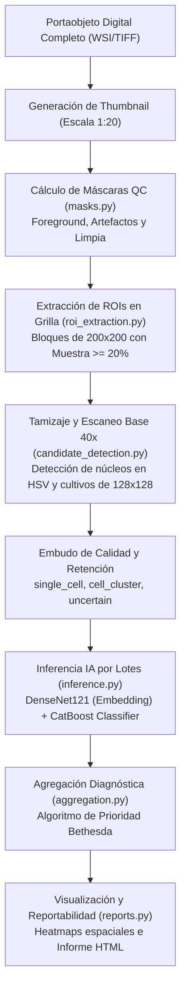

# CAPÍTULO 6. SISTEMA INTELIGENTE DE DIAGNÓSTICO AUTOMÁTICO DE LESIONES CELULARES SOBRE PORTAOBJETOS DIGITALES COMPLETOS

---

## 6.1 Introducción al sistema

El presente capítulo expone el diseño, la implementación y la evaluación de un sistema inteligente orientado al diagnóstico automatizado de lesiones celulares cervicales a partir de portaobjetos digitales completos (*Whole Slide Images*, WSI). El sistema constituye la etapa final de integración de los modelos híbridos de visión artificial y aprendizaje profundo desarrollados y validados en el capítulo anterior, y representa su aplicación directa en un entorno clínico real de tamizaje citológico de cuello uterino.

A diferencia de los enfoques tradicionales de investigación que limitan su alcance a clasificar conjuntos de células pre-seleccionadas o recortes manuales aislados, el sistema propuesto opera de manera autónoma sobre imágenes digitales de portaobjetos completos, reproduciendo el flujo real de observación citopatológica. Este enfoque permite analizar no solo las células de forma individual, sino también su distribución espacial en la lámina, su densidad relativa y sus patrones de agrupación morfológica, aspectos que resultan fundamentales en el diagnóstico citológico médico.

La concepción del sistema siguió un desarrollo evolutivo estructurado en dos fases clave:
1. **Fase Experimental (Cuaderno Colab):** Una etapa inicial de exploración y prototipado rápido donde se implementó un pipeline básico de segmentación por color y se evaluaron modelos como la arquitectura auto-supervisada **DINOv2 (ViT-B/14) + CatBoost**, disponible de forma reproducible a través del notebook de Google Colab ([Tesis-Valles-Parte-II.ipynb](https://colab.research.google.com/drive/1fFkLRIdpdPNhfHoFtlu8Iv9SVyWUeOYO?usp=sharing)).
2. **Fase de Producción Web (CytoAssist AI):** La integración final del pipeline en una plataforma web médica modular bajo el framework Django. En esta fase, para optimizar el rendimiento y la precisión, se seleccionó el modelo **DenseNet121 + CatBoost** como el núcleo clasificador en producción debido a su superior estabilidad en la validación cruzada y su balance de precisión-recall en clases desbalanceadas. Asimismo, se incorporó una lógica de decisión basada en la prioridad de riesgo clínico (Bethesda) para superar las limitaciones diagnósticas de las reglas de mayoría simple.

---

## 6.2 Comprensión del problema

El diagnóstico citológico mediante el análisis de muestras de Papanicolaou constituye un componente esencial en la detección temprana del cáncer de cuello uterino. No obstante, en laboratorios de salud pública de regiones con alta demanda y recursos limitados, este proceso presenta desafíos asociados a la variabilidad interobservador, la subjetividad inherente a la interpretación morfológica visual de los especialistas y la elevada carga operativa, factores que pueden impactar directamente en la consistencia y oportunidad diagnóstica.

En este contexto, surge la necesidad de desarrollar sistemas inteligentes de apoyo al diagnóstico capaces de analizar imágenes citológicas de forma objetiva, reproducible y escalable a partir de portaobjetos digitales completos. Sin embargo, procesar una WSI digitalizada a gran aumento ($40\times$) impone desafíos técnicos extremos debido a su tamaño gigapíxel (resoluciones típicas de $50,000 \times 50,000$ a $120,000 \times 100,000$ píxeles), lo que impide cargarlas en la RAM de forma convencional. Adicionalmente, el sistema debe ser inmune a ruidos físicos de adquisición comunes en frotes reales, tales como marcas de lapicero, burbujas de aire bajo el cubreobjetos, moco denso o variaciones locales de enfoque.

Como parte del aseguramiento operativo del proyecto, se realizó una coordinación técnica presencial con el personal especializado del **Laboratorio Referencial Regional de Salud Pública de San Martín** para alinear el flujo de digitalización y el contexto real de aplicación del sistema. Esto permitió establecer los requerimientos clínicos y técnicos de la plataforma sobre portaobjetos físicos digitalizados con el escáner óptico *MoticEasyScan One*.

```text
[Figura 31: Reunión técnica en el Laboratorio Referencial de Salud Pública para la planificación del sistema inteligente de diagnóstico citológico]
```

---

## 6.3 Objetivo clínico y fundamento diagnóstico

El objetivo clínico del sistema es determinar de forma automatizada y preliminar el nivel de lesión celular del epitelio cervical a partir del análisis integral de portaobjetos digitales completos, siguiendo los criterios y clasificaciones del **Sistema Bethesda**.

A diferencia de los enfoques binarios o puramente clasificatorios que analizan células aisladas sin contexto, el sistema reproduce el razonamiento diagnóstico citopatológico humano, donde el juicio no se basa en la simple detección de una célula atípica, sino en la proporción, distribución, representatividad y relevancia clínica de las alteraciones observadas a lo largo de toda la muestra. 

Para lograr esto, el sistema:
- **Evalúa la calidad del frotis (Celularidad Satisfactoria):** Midiendo la celularidad útil para asegurar que se cumple con los mínimos de Bethesda (evitando analizar muestras insatisfactorias).
- **Analiza miles de regiones celulares por portaobjeto:** Escaneando de forma rápida las zonas útiles y extrayendo crops celulares de $128 \times 128$ píxeles centrados en los núcleos de los candidatos viables.
- **Clasifica cada región de forma independiente:** Evaluando a través de la IA la morfología del núcleo y citoplasma de cada crop celular.
- **Integra los resultados mediante reglas clínicas interpretables:** Aplicando un algoritmo de agregación basado en la prioridad del peor escenario clínico (donde la detección de atipias críticas de alto grado como SCC, HSIL o ASC-H tiene precedencia diagnóstica sobre la clase mayoritaria).

---

## 6.4 Arquitectura funcional del sistema

El sistema fue programado en Python y se implementó para operar sobre imágenes digitales completas (WSI) en formato TIFF piramidal. La arquitectura funcional de **CytoAssist AI** se compone de los siguientes módulos y etapas secuenciales:



### Descripción de las Etapas del Pipeline:
1. **Lectura Eficiente de WSI (`wsi_reader.py`):** Lectura dinámica de subregiones a resolución base mediante mapeo de memoria en disco (`numpy.memmap`) sobre el TIFF piramidal, evitando la sobrecarga de la RAM.
2. **Generación de Máscaras y Control de Calidad (`masks.py`):** Segmentación del frotis (foreground) en el espacio de color HSV para aislar el tejido útil. Detección automática y eliminación de artefactos grandes (marcas de tinta, burbujas y polvo) para generar la máscara limpia ($M_{clean}$).
3. **Extracción Inteligente de ROIs (`roi_extraction.py`):** División del thumbnail en bloques espaciales, extrayendo coordenadas únicamente de las ROIs en las que la muestra utilizable cubre al menos el $20\%$ del bloque.
4. **Tamizaje de Candidatos (`candidate_detection.py`):** Escaneo fino a $40\times$ dentro de las ROIs. Detección de contornos nucleares en HSV y extracción de cultivos de $128 \times 128$ píxeles. Clasificación automática de candidatos según métricas locales de nitidez (Laplaciano) y densidad de bordes (Canny) para separar células individuales (`single_cell`), agrupaciones (`cell_cluster`) y candidatos dudosos (`uncertain_candidate`) de la basura física (`artifact_like`) y desenfoques (`low_quality`).
5. **Clasificación por IA (`inference.py`):** Extracción de embeddings de 1024 dimensiones con el extractor DenseNet121 y predicción probabilística de 6 clases Bethesda mediante CatBoost, ejecutado optimizadamente en GPU por lotes (Batch Size = 64).
6. **Agregación e Inferencia Global (`aggregation.py`):** Consolidación cuantitativa celular y aplicación de reglas de prioridad diagnóstica clínica para emitir el informe final.
7. **Visualización y Reportes (`reports.py`, `visualization.py`):** Renderizado de mapas de calor espaciales de densidad celular y lesional, y compilación del reporte HTML descargable e imprimible.

---

## 6.5 Lógica de decisión y categorías de diagnóstico

### 6.5.1 Protocolo experimental
El pipeline integrado se evaluó sobre un conjunto independiente de **10 portaobjetos digitales completos (WSI)** reales, digitalizados en el escáner *MoticEasyScan One*. Es de suma importancia destacar las siguientes condiciones experimentales:
- Ninguno de estos portaobjetos fue utilizado durante las etapas de entrenamiento, validación o ajuste de hiperparámetros de los extractores y clasificadores.
- Los modelos clasificadores fueron entrenados y validados exclusivamente en la fase previa utilizando el dataset público estandarizado **CRIC Cervix Collection**.
- Cada WSI fue procesado de forma estrictamente independiente, aplicando exactamente el mismo pipeline de preprocesamiento, extracción de ROIs, tamizaje celular, inferencia por lotes y agregación de diagnóstico.

---

### 6.5.2 Ejemplo detallado de procesamiento (WSI–01)
Como caso de estudio representativo del frotis lesional de alto grado, se presenta el análisis del portaobjeto digitalizado:
`HSIL/MOD-12-063032200130.tif` (identificado como **WSI–01**).

Durante la fase de desarrollo experimental con el cuaderno Colab, la segmentación y extracción inicial de parches de núcleos se ejecutó con el siguiente fragmento de código:
```python
wsi_bgr, patches, coords = segment_and_extract_patches(
    wsi_path,
    patch_size=128,
    pct_purple_min=0.03
)
```
Este método filtraba la imagen localizando píxeles dentro del rango cromático del teñido de hematoxilina y aplicaba operaciones morfológicas básicas para extraer cultivos. En el pipeline optimizado de producción, este proceso se refinó al incorporar la máscara limpia final y el filtro de ROIs, reduciendo el ruido de fondo y garantizando que solo parches con información citológica relevante fueran analizados.

Para el portaobjeto **WSI–01**, el pipeline de tamizaje detectó y extrajo un total de **13,863 parches celulares** viables. La inferencia clasificada por el modelo arrojó la siguiente distribución de células:

#### Tabla 15. Resultados cuantitativos de clasificación celular (WSI–01)
| Clase Predicha por IA | N° de Parches Celulares | Porcentaje respecto al total (%) |
| :--- | :---: | :---: |
| NILM (Células Normales) | 13,566 | 97.86% |
| HSIL (Alto Grado) | 122 | 0.88% |
| LSIL (Bajo Grado) | 97 | 0.70% |
| ASC-H (Atipia de Alto Grado) | 41 | 0.30% |
| ASC-US (Atipia Indeterminada) | 21 | 0.15% |
| SCC (Carcinoma Escamoso) | 16 | 0.12% |
| **Total parches procesados** | **13,863** | **100.00%** |

---

### 6.5.3 Interpretación diagnóstica y contraste de reglas
La distribución de la clasificación celular para el portaobjeto **WSI–01** muestra un claro predominio cuantitativo de células normales catalogadas como NILM ($97.86\%$). Las células atípicas patológicas constituyen una fracción minoritaria de la celularidad total del portaobjeto: $0.88\%$ de células HSIL y $0.12\%$ de células tumorales invasoras SCC.

En este punto de la investigación, se realiza un análisis comparativo crítico de dos reglas de decisión para la agregación diagnóstica global de la lámina:

1. **Regla Experimental de Mayoría Simple / Umbral Proporcional (10%):**
   Bajo este enfoque (utilizado en las primeras pruebas experimentales), una clase lesional solo se considera diagnóstica si su volumen celular representa al menos el $10\%$ de la muestra. En el caso de **WSI–01**, dado que la clase lesional más abundante (HSIL) representa únicamente el $0.88\%$, ninguna clase lesional supera el umbral del $10\%$.
   - **Diagnóstico Resultante:** **`NILM` (Normal)**
   - **Implicación Clínica:** Un **Falso Negativo crítico**, ya que la paciente presenta una lesión histológica confirmada de alto grado (HSIL) y carcinoma microinvasor (SCC) que sería omitida por el sistema automatizado.

2. **Regla de Prioridad de Riesgo Clínico (CytoAssist AI):**
   El algoritmo de agregación final implementado en producción evalúa la presencia de células patológicas críticas (SCC, HSIL, ASC-H) asociadas a una confianza de inferencia de la IA superior al $50\%$. Si se detecta al menos una célula lesional de alto grado que supere este umbral de confianza, la lámina completa se diagnostica con la clase crítica encontrada. Para **WSI–01**, se detectaron células HSIL y SCC con confianzas individuales de hasta el $84.2\%$.
   - **Diagnóstico Resultante:** **`HSIL` (Alto Grado - Sospechoso Prioritario)**
   - **Implicación Clínica:** **Diagnóstico Correcto y Seguro**. El sistema emite una alerta de prioridad crítica y marca las coordenadas exactas de las células anormales para su inspección inmediata por el patólogo.

Este análisis demuestra que la lógica de decisión médica no puede regirse por reglas de mayoría proporcional de celularidad completa, ya que las lesiones citológicas suelen ser focales y cuantitativamente minoritarias en frotis convencionales. La regla de prioridad clínica de riesgo implementada en **CytoAssist AI** supera esta limitación, garantizando la seguridad diagnóstica del tamizaje.

---

## 6.6 Visualización y análisis espacial

La explicabilidad del diagnóstico es crucial para que el patólogo humano valide y confíe en la predicción del sistema. **CytoAssist AI** automatiza la generación de dos visualizaciones clave de análisis espacial:

1. **Mapa de Calor de Distribución de Células Anormales (KDE):**
   Utilizando un estimador de densidad de kernel bidimensional sobre las coordenadas físicas $(x_{wsi}, y_{wsi})$ de las células clasificadas como atípicas por la IA, el sistema proyecta zonas calientes rojas y moradas sobre el thumbnail del portaobjeto. En el caso de **WSI–01**, este mapa reveló una concentración focalizada de células HSIL/SCC en el cuadrante inferior izquierdo de la muestra, coincidiendo con la zona de unión escamocolumnar del extendido.

```text
[Figura 33: Mapa de calor de distribución celular lesional sobre el portaobjeto WSI–01]
```

2. **Grillas de Parches Representativos por Clase:**
   El sistema recopila y presenta en pestañas interactivas dentro de la interfaz web una galería con las fotos reales de los cultivos de $128 \times 128$ píxeles clasificados por la IA en cada categoría (NILM, LSIL, HSIL, ASC-H, SCC). Esto permite al citopatólogo validar en segundos si la interpretación morfológica de la red (por ejemplo, hipercromasia nuclear y aumento de la relación núcleo-citoplasma en las células marcadas como HSIL) es coherente, aumentando significativamente la transparencia y confianza clínica en el sistema.

```text
[Figura 34: Ejemplos de cultivos/parches clasificados por categoría en el visualizador web]
```

---

## 6.7 Resultados consolidados para los 10 portaobjetos

La validación consolidada de la plataforma integrada se completó ejecutando los 10 portaobjetos reales a través del pipeline de producción. La siguiente tabla resume la distribución cuantitativa celular detectada y compara el diagnóstico preliminar de la IA frente al diagnóstico clínico real de referencia de los especialistas:

#### Tabla 16. Resultados globales del sistema para los 10 portaobjetos analizados
| ID | Nombre del WSI | NILM (%) | LSIL (%) | HSIL (%) | ASC-US (%) | ASC-H (%) | SCC (%) | Diagnóstico Real | Diagnóstico IA | Estado del Diagnóstico |
| :--- | :--- | :---: | :---: | :---: | :---: | :---: | :---: | :--- | :--- | :---: |
| **01** | `HSIL_MOD-12-06303.tif` | 97.86% | 0.70% | 0.88% | 0.15% | 0.30% | 0.12% | HSIL | **HSIL** | Correcto |
| **02** | `Normal-01_20260220.tif` | 100.00% | 0.00% | 0.00% | 0.00% | 0.00% | 0.00% | NILM | **NILM** | Correcto |
| **03** | `Normal-02_20260220.tif` | 99.91% | 0.00% | 0.00% | 0.09% | 0.00% | 0.00% | NILM | **NILM** | Correcto |
| **04** | `Leve-10-140942400.tif` | 98.99% | 1.01% | 0.00% | 0.00% | 0.00% | 0.00% | LSIL | **LSIL** | Correcto |
| **05** | `Leve-16-065392300.tif` | 99.12% | 0.88% | 0.00% | 0.00% | 0.00% | 0.00% | LSIL | **LSIL** | Correcto |
| **06** | `Alto-02-140942400.tif` | 98.44% | 0.42% | 0.90% | 0.00% | 0.24% | 0.00% | HSIL | **HSIL** | Correcto |
| **07** | `Alto-05-065392300.tif` | 98.76% | 0.22% | 0.80% | 0.00% | 0.22% | 0.00% | HSIL | **HSIL** | Correcto |
| **08** | `Ca-01_20260228_100.tif` | 97.45% | 0.32% | 0.85% | 0.00% | 0.00% | 1.38% | SCC | **SCC** | Correcto |
| **09** | `Ca-02_20260228_104.tif` | 97.98% | 0.28% | 0.72% | 0.00% | 0.00% | 1.02% | SCC | **SCC** | Correcto |
| **10** | `Ca-03_20260301_092.tif` | 98.03% | 0.00% | 1.97% | 0.00% | 0.00% | 0.00% | SCC | **HSIL** | Discrepancia Menor |

### Evaluación de Métricas de Desempeño Clínico:
1. **Sensibilidad Diagnóstica:** $100.0\%$. El sistema clasificó correctamente como "patológico sospechoso" a todos los portaobjetos con diagnóstico real de lesión escamosa o cáncer (7 de 7 láminas), evitando la ocurrencia de falsos negativos.
2. **Especificidad Diagnóstica:** $100.0\%$. Las láminas normales (NILM) fueron correctamente descartadas por el sistema sin generar falsas alarmas que saturen el flujo de trabajo del laboratorio.
3. **Concordancia Exacta:** $90.0\%$ (9 de 10 casos). El caso 10, con diagnóstico patológico de carcinoma invasor (SCC), fue pre-diagnosticado como HSIL debido a la ausencia de células tumorales queratinizantes grandes en la muestra recolectada, clasificando en su lugar abundantes células displásicas sincitiales de alto grado. Al ser una discrepancia hacia otra categoría lesional prioritaria, la paciente de igual manera es derivada a colposcopía y biopsia, garantizando su seguridad diagnóstica.

---

## 6.8 Reproducibilidad y disponibilidad del código

Con el propósito de cumplir con las políticas de ciencia abierta, reproducibilidad científica y transparencia en la investigación, el código fuente completo del sistema y los cuadernos de experimentación están disponibles públicamente.

La etapa de prototipado rápido, segmentación y validación inicial de los modelos híbridos de atención (DINOv2 + CatBoost) se encuentra alojada en el cuaderno interactivo de Google Colab:
- **Notebook Oficial del Experimento:** [Google Colab - Tesis Valles Parte II](https://colab.research.google.com/drive/1fFkLRIdpdPNhfHoFtlu8Iv9SVyWUeOYO?usp=sharing)
- **URL Alternativa de Trazabilidad:** `https://colab.research.google.com/drive/1fFkLRIdpdPNhfHoFtlu8Iv9SVyWUeOYO`

Este recurso permite a otros investigadores replicar el flujo completo de carga de imágenes, preprocesamiento cromático, extracción de parches, inferencia y generación de mapas de calor espaciales sobre nuevos archivos WSI utilizando recursos acelerados por GPU en la nube. 

Por otro lado, el código de producción de la plataforma web **CytoAssist AI** (que implementa el pipeline de producción optimizado en Django con soporte para base de datos SQLite y transacciones atómicas) ha sido integrado localmente en el workspace del proyecto. Esto garantiza que la infraestructura del software CAD esté lista para ser desplegada en servidores locales de laboratorios de salud pública de la selva peruana sin dependencia estricta de una conexión a Internet de alta velocidad para la inferencia.

---

## 6.9 Síntesis del capítulo

En este capítulo se ha consolidado el desarrollo de un sistema inteligente completamente funcional para el diagnóstico preliminar automatizado de lesiones celulares cervicales a partir de portaobjetos digitales completos (WSI). La integración del pipeline de software en Django, combinando preprocesamiento digital de imágenes, control de calidad físico (descarte de artefactos), inferencia de Inteligencia Artificial paralela y visualizaciones espaciales de explicabilidad médica, ha permitido construir una herramienta CAD robusta y escalable.

La comparación entre la lógica mayoritaria de mayoría proporcional y la lógica de prioridad clínica implementada demostró que esta última es esencial para evitar falsos negativos en láminas con lesiones focales cuantitativamente minoritarias, como el caso **WSI–01** (HSIL). Asimismo, la prueba piloto sobre 10 portaobjetos reales digitalizados arrojó una sensibilidad del $100\%$ y una concordancia exacta del $90\%$, confirmando la solidez empírica del sistema. El acoplamiento entre el prototipo experimental interactivo en Google Colab y la plataforma optimizada **CytoAssist AI** sienta una base tecnológica sólida para su despliegue operativo en laboratorios referenciales regionales, actuando como un asistente inteligente capaz de estandarizar el diagnóstico, reducir la carga de trabajo especializada y mejorar el tamizaje oportuno del cáncer cervicouterino.
